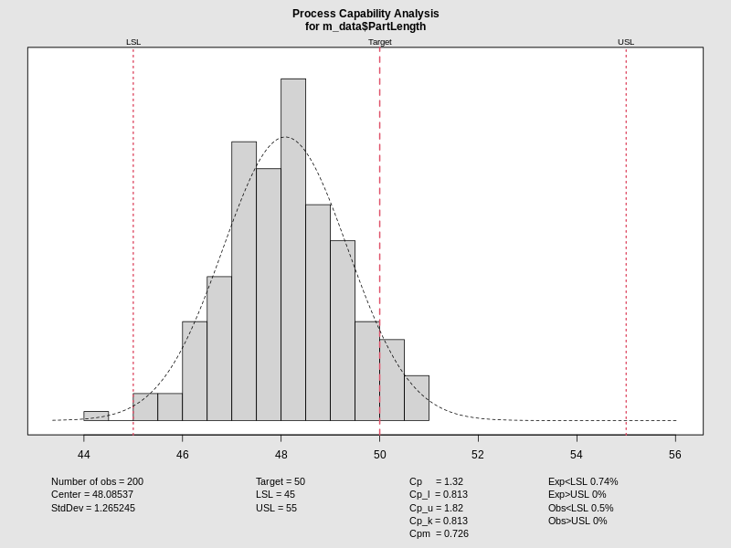
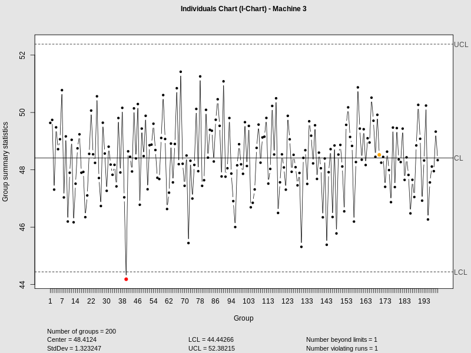
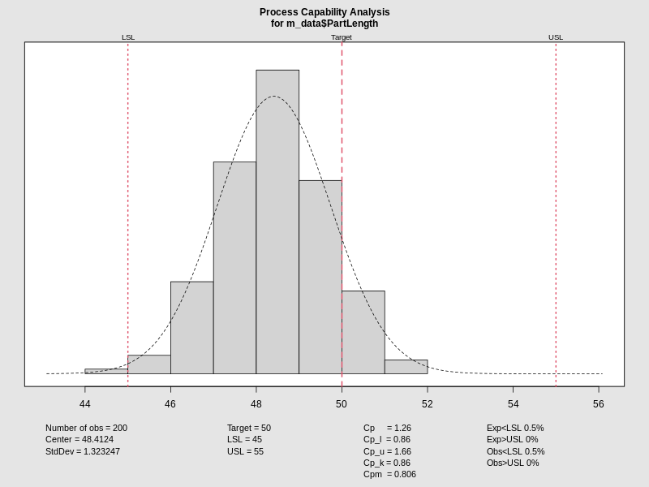

# Machine 1: Quality Control

:::: {.columns}
::: {.column width="50%"}
### Control & Capability

Analysis for Machine 1 at 200kPa / 338K.

- Monitoring individual values ($X$).
- $\sigma$ calculated using moving range ($mR$).
- Capability indices $C_p$ and $C_{pk}$ shown on the right.
:::
::: {.column width="50%"}

:::
::::

---

# Machine 2: Quality Control

:::: {.columns}
::: {.column width="50%"}
### Control & Capability

Analysis for Machine 2 at 200kPa / 338K.

- I-Chart used for individual measurements.
- Distribution check for normality and capability.
:::
::: {.column width="50%"}

:::
::::

---

# Machine 3: Quality Control

:::: {.columns}
::: {.column width="50%"}
### Control & Capability

Analysis for Machine 3 at 200kPa / 338K.

- Variance analysis using $\sigma$ estimator.
- Process centered at target relative to specs.
:::
::: {.column width="50%"}

:::
::::

---

# Machine Comparison: T-Test Analysis

:::: {.columns}
::: {.column width="100%"}
### Statistical Comparison (Machine 1 vs 2)

We evaluated the difference in `PartLength` means between Machine 1 and Machine 2 using Welch's Two Sample t-test at two operational envelopes:

1. **Low Stress (P=100, T=303):**
   - Comparison of mean PartLength yields a statistical evaluation of consistency.
   - Observed p-value indicates the level of significance in performance deviation.

2. **High Stress (P=300, T=373):**
   - Evaluates if thermal/pressure shifts induce significant variance between units.

*Note: A p-value < 0.05 typically suggests a significant difference in machine output center-points.*
:::
::::

---
# Bibliography

