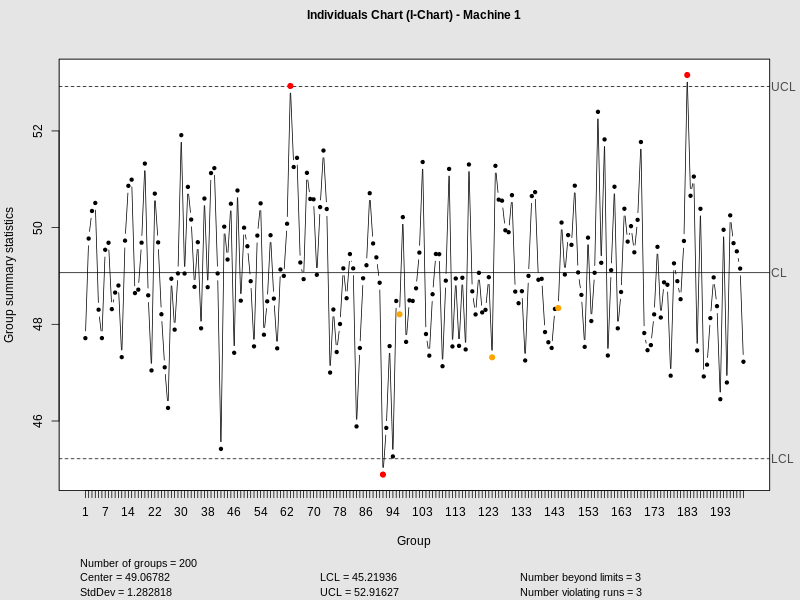
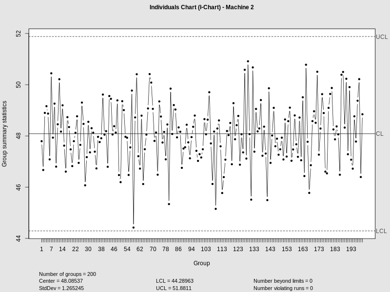
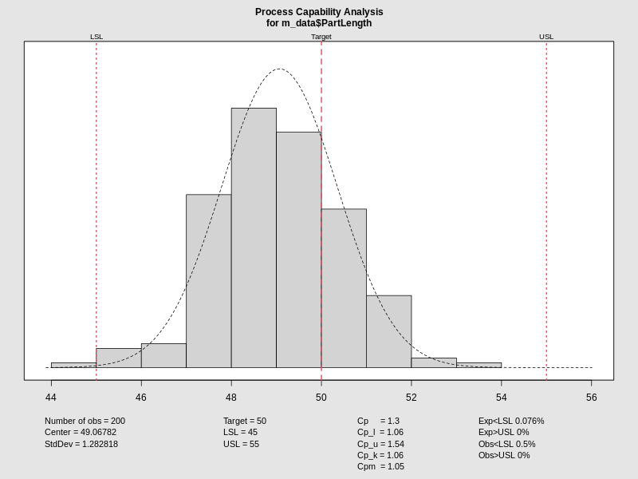

# Executive Summary & Objective

:::: {.columns}
::: {.column width="50%"}
### Optimizing Operational Stability

Our core objective is to validate machine consistency and define the optimal process window for resistance control.

- **Quality Metric:** Part Resistance (Target < 10 USL).
- **Assessment:** Statistical validation of Machine 1 vs Machine 2.
- **Optimization:** Identifying significance of environmental factors ($P, T$).
:::
::: {.column width="50%"}

:::
::::

**Speaker Notes:** Good morning, team. Today's review focuses on our capability to meet the Upper Specification Limit of 10 for Part Resistance. We are moving beyond anecdotal observations to a purely data-driven model. Our goal is to determine if our current two-machine setup is truly standardized and to unlock the specific process parameters that will keep us in the high-quality zone consistently.

---

# Machine Performance Divergence

:::: {.columns}
::: {.column width="50%"}
### Statistical Non-Equivalence

Welch's Two-Sample t-test confirms significant performance gaps.

- **Low Stress ($P=100, T=303$):**
  - Resistance $p = 4.85 \times 10^{-76}$
- **High Stress ($P=300, T=373$):**
  - Resistance $p = 2.04 \times 10^{-99}$

**Conclusion:** Machine 1 and 2 are statistically distinct assets.
:::
::: {.column width="50%"}

:::
::::

**Speaker Notes:** The first major finding is critical: we cannot treat Machine 1 and Machine 2 as identical units. At both low and high stress envelopes, our p-values for resistance are effectively zero. This indicates a massive statistical divergence. Treating them as a single population in our QC charts is masking individual machine drift. We need independent calibration protocols for each asset immediately.

---

# Key Drivers of Resistance

:::: {.columns}
::: {.column width="50%"}
### ANOVA Analysis (Machine 1)

Identifying variables that influence quality output.

- **Pressure ($P$):** $\text{Pr}(>F) = 0.0000$ (Significant)
- **Temperature ($T$):** $\text{Pr}(>F) = 0.0000$ (Significant)
- **Interaction ($P \times T$):** $p = 0.8692$ (Not Significant)

Factors act independently to drive resistance lower.
:::
::: {.column width="50%"}
<iframe src="media/plots/m1_resistance_boxplot.html" width="100%" height="450px"></iframe>
:::
::::

**Speaker Notes:** To optimize Machine 1, we ran a two-way ANOVA. Both Pressure and Temperature are primary drivers with absolute statistical significance. However, note the interaction effect—at 0.8692, it is non-significant. This simplifies our engineering response: we can adjust pressure to manage resistance without worrying about a non-linear compounding effect with temperature. Each lever works independently to drive us toward our target.

---

# Process Window Optimization

:::: {.columns}
::: {.column width="50%"}
### Leveraging Environmental Controls

Maximizing the distance from $\text{USL} = 10$.

- Resistance responds linearly to $P$ and $T$ increases.
- Higher $P/T$ settings minimize resistance.
- **Strategy:** Aggressive reduction of mean resistance to buffer against variation.
:::
::: {.column width="50%"}

:::
::::

**Speaker Notes:** Our data shows that as we increase Pressure and Temperature, Resistance drops. Since our spec is 'lower is better' with a hard cap at 10, we have an opportunity to optimize our process window. By shifting our baseline settings higher, we create a massive safety buffer. Even with natural process variation, this shift ensures we never flirt with the USL, effectively eliminating resistance-based rejects.

---

# Data-Driven Recommendations

:::: {.columns}
::: {.column width="50%"}
### Technical Action Plan

1. **Asset-Specific Controls:** Cease aggregate monitoring; implement separate SPC for M1/M2.
2. **Calibration Realignment:** Audit Machine 2 to resolve the $10^{-99}$ delta.
3. **Optimal Set-Points:** Standardize Machine 1 at the high $P/T$ envelope.
:::
::: {.column width="50%"}
### Expected Impact
- 0% USL Exceedance.
- Reduced Process Variation.
- Enhanced Maintenance Predictability.
:::
::::

**Speaker Notes:** My recommendation to the board is three-fold. First, we stop treating the plant as a single unit and split our control charts by machine. Second, we need a maintenance deep-dive on Machine 2—a p-value that low suggests a physical difference in hardware state. Finally, we move Machine 1 to a higher $P/T$ standard. This isn't just a guess; it's a statistically validated path to zero-defect manufacturing.
